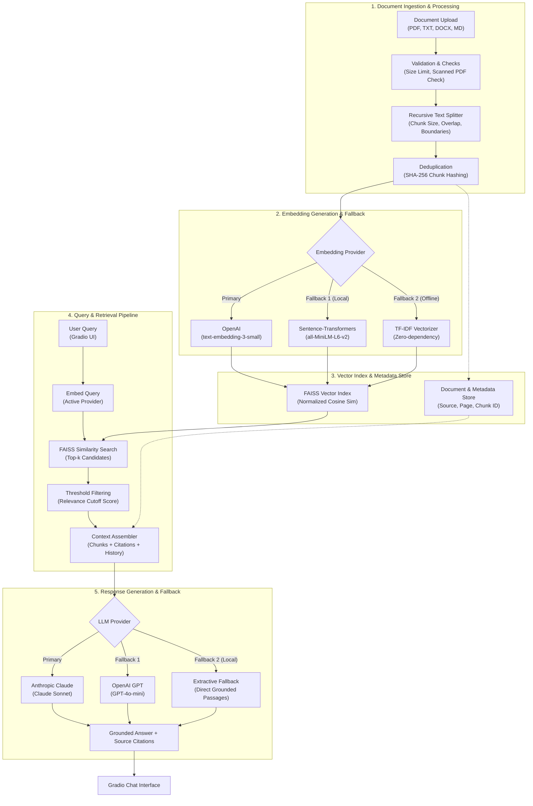

# Mini AI Knowledge Assistant (RAG)

A Retrieval-Augmented Generation (RAG) app: upload a document, ask questions
about it in plain English, and get answers **grounded in that document's
actual content** — with source citations — instead of an LLM guessing from
its general training data. Out-of-scope questions are declined rather than
hallucinated.

Built as a self-contained, end-to-end RAG system: ingestion → chunking →
embeddings → vector search → grounded generation → a chat UI — with
automatic, dependency-free fallbacks at every stage so the app is **always
runnable, even with zero API keys**.

Full requirements, rationale, and design trade-offs are in
[`PRD_Mini_RAG_Assistant.md`](PRD_Mini_RAG_Assistant.md); this README covers
what the project does, how it's built, and how to run it.

---

## Why this project

Knowledge (handbooks, policies, reports, contracts) is often locked inside
documents that are slow to search manually. Asking a generic LLM chatbot is
risky for anything fact-sensitive — it can *sound* confident while answering
from its training data instead of the document in front of it. This project
solves that by forcing every answer to be retrieved from, and cited to, the
uploaded source material, and by explicitly refusing to answer when the
document doesn't cover the question.

## Key features

- **Multi-format ingestion** — PDF, TXT, Markdown, DOCX, with page-level
  metadata preserved for PDFs.
- **Boundary-aware chunking** — a recursive splitter (paragraph → line →
  sentence → word) with configurable size/overlap, so chunks stay
  semantically whole instead of being cut mid-sentence.
- **Pluggable embeddings with automatic fallback** — OpenAI
  `text-embedding-3-small` → local Sentence-Transformers → TF-IDF
  (zero-dependency, always works).
- **Pluggable LLM generation with automatic fallback** — Anthropic Claude →
  OpenAI GPT → an extractive fallback that returns the most relevant
  passages directly, no API key required.
- **Exact cosine-similarity vector search** via FAISS (`IndexFlatIP` on
  normalized vectors).
- **Relevance thresholding** — low-confidence retrievals are rejected
  instead of being forced into an answer, so out-of-scope questions get an
  honest "not covered" response.
- **Source citations** (filename + page/section + relevance score) on every
  answer.
- **Runtime resilience** — if an embedding/LLM API call fails mid-session
  (bad key, rate limit, outage), the pipeline automatically downgrades to
  the next local-capable backend and says so in the UI, instead of crashing.
- **Duplicate detection** (SHA-256 file hashing), file-size limits, and
  explicit rejection of scanned/image-only PDFs (no silent empty answers).
- **Multi-document, cumulative indexing** and **conversation history**
  (last 3 turns fed back into the prompt for follow-up questions).
- **Index persistence** — the FAISS index and metadata are saved to disk so
  a restart doesn't force re-embedding everything.
- **Gradio chat UI** — upload, index, ask, and reset, in one page.

## Live demo / running it

```bash
python -m venv .venv
source .venv/Scripts/activate   # Windows Git Bash / PowerShell: .venv\Scripts\Activate.ps1
pip install -r requirements.txt
python app.py
```

Opens a Gradio UI at `http://127.0.0.1:7860`. Upload a file from
`sample_docs/` (or your own PDF/TXT/MD/DOCX), click **Index document(s)**,
then ask a question.

**No API key is required** — with none set, the app runs on TF-IDF
embeddings and extractive answers (returns the most relevant passages
verbatim instead of a generated answer), so a reviewer with zero setup
still sees a fully working demo. To unlock semantic embeddings and
LLM-generated answers, copy `.env.example` to `.env` and set
`OPENAI_API_KEY` and/or `ANTHROPIC_API_KEY`.

## Tech stack

| Layer | Technology | Why |
|---|---|---|
| Language | Python 3 | |
| UI | [Gradio](https://gradio.app) | Fastest way to ship a chat UI with file upload in one file, trivially deployable |
| Vector search | [FAISS](https://github.com/facebookresearch/faiss) (`IndexFlatIP`) | Exact, fast cosine similarity for small-to-medium corpora |
| Embeddings | OpenAI API / Sentence-Transformers / scikit-learn `TfidfVectorizer` | Tiered so the app degrades gracefully instead of hard-requiring a paid API |
| LLM generation | Anthropic Claude / OpenAI GPT / rule-based extractive fallback | Same tiered-degradation philosophy |
| Document parsing | `pypdf`, `python-docx` | PDF and DOCX text + page extraction |
| Config | `python-dotenv` | All tunables env-overridable, centralized in `config.py` |
| Testing | `pytest` | Runs fully offline against the TF-IDF + extractive backends |
| Deployment | Render (free tier) | `0.0.0.0` host + `$PORT` env var wired in `app.py`; optional heavy deps (PyTorch/Sentence-Transformers) trimmed from `requirements.txt` to fit the 512MB free-tier memory limit |

## Project structure

| File | Responsibility |
|---|---|
| `app.py` | Gradio UI — upload, index, chat, reset, status bar |
| `rag_pipeline.py` | Orchestrates ingestion → embedding → retrieval → generation; owns dedup, relevance thresholding, conversation history, runtime fallback, and index persistence |
| `ingestion.py` | Document loading (PDF/TXT/MD/DOCX), file hashing, size limits, scanned-PDF detection, recursive boundary-aware chunking |
| `embeddings.py` | Pluggable embedding backends (OpenAI / Sentence-Transformers / TF-IDF) with auto-selection and runtime downgrade |
| `vectorstore.py` | FAISS wrapper — add/search/rebuild/save/load over normalized vectors |
| `llm_providers.py` | Pluggable LLM backends (Claude / GPT / extractive), prompt construction with citation markers |
| `config.py` | Central, env-overridable configuration (chunk size, top-k, thresholds, model names, limits) |
| `PRD_Mini_RAG_Assistant.md` | Full requirements, scope, design-decision rationale, and future work |
| `tests/` | Pytest suite — ingestion, embeddings, vector store, pipeline, and UI-handler tests |
| `sample_docs/` | A sample document to try the app against immediately |

## How it works

1. **Ingest** — `ingestion.py` loads the uploaded file, rejects it early if
   it's unsupported, oversized, or a scanned PDF with no extractable text,
   and hashes it to skip duplicate re-uploads.
2. **Chunk** — text is recursively split on paragraph → line → sentence →
   word boundaries (`~900` chars, `150` char overlap by default) so chunks
   stay semantically coherent and don't lose facts that straddle a
   boundary.
3. **Embed** — chunks are embedded with the best available backend (OpenAI
   → Sentence-Transformers → TF-IDF), normalized for cosine similarity, and
   added to a FAISS index.
4. **Retrieve** — a question is embedded with the same active backend,
   FAISS returns the top candidates, results below a per-backend relevance
   threshold are dropped (score distributions differ meaningfully between
   semantic and lexical backends), and near-duplicate chunks are
   deduplicated by word overlap.
5. **Generate** — the surviving chunks are assembled into a prompt with
   numbered citation markers and the last few conversation turns, then sent
   to the active LLM backend. If nothing survives retrieval, the app
   explicitly says the question isn't covered instead of guessing.
6. **Respond** — the answer is returned to the Gradio chat UI along with a
   citation list (source file, page, relevance score).

## Configuration

All defaults live in [`config.py`](config.py) and are overridable via env
vars — see [`.env.example`](.env.example):

| Setting | Default | Purpose |
|---|---|---|
| `RAG_CHUNK_SIZE` | 900 | Max characters per chunk |
| `RAG_CHUNK_OVERLAP` | 150 | Overlap between adjacent chunks |
| `RAG_TOP_K` | 4 | Chunks fed to the LLM per question |
| `RAG_MAX_FILE_SIZE_MB` | 20 | Per-file upload limit |
| `RAG_HISTORY_TURNS` | 3 | Conversation turns kept for follow-ups |
| `OPENAI_MODEL` / `OPENAI_EMBEDDING_MODEL` | `gpt-4o-mini` / `text-embedding-3-small` | OpenAI model choices |
| `ANTHROPIC_MODEL` | `claude-sonnet-5` | Anthropic model choice |
| `SENTENCE_TRANSFORMER_MODEL` | `all-MiniLM-L6-v2` | Local embedding model (optional dependency) |

Relevance thresholds are also per-backend (OpenAI `0.25`,
Sentence-Transformers `0.30`, TF-IDF `0.10`) since cosine-similarity score
distributions differ by embedding type — a single global cutoff would
either over-reject semantic backends or under-reject lexical ones.

## Design decisions worth knowing

| Decision | Rationale |
|---|---|
| Recursive chunking over fixed-size windows | Fixed-size chunking cuts mid-sentence and mid-idea, hurting retrieval precision. |
| Pluggable embedding + LLM backends with automatic fallback | Deliberate reliability choice, not a shortcut: a reviewer with no API key still gets a working demo; a configured key unlocks full semantic quality. |
| Relevance threshold before generation | Without it, retrieval always returns *something*, and an LLM will often try to answer anyway. Thresholding forces an honest "not covered" response. |
| Runtime backend downgrade on API failure | A bad key, rate limit, or outage mid-session degrades the pipeline to the next local-capable backend instead of crashing the app. |
| Gradio over a custom frontend | Fastest path to a chat UI with file upload in one file, and trivially deployable for a public demo link. |
| Heavy optional deps (PyTorch/Sentence-Transformers) commented out of `requirements.txt` | Keeps the deployed footprint under free-tier hosting memory limits (e.g. Render's 512MB); the app still runs fully via the TF-IDF fallback with these uninstalled. |

More decisions, including the six gaps found and closed during a PRD review
pass (privacy, retrieval params, duplicate handling, scanned PDFs, API
failure handling, file size limits), are documented in
[`PRD_Mini_RAG_Assistant.md`](PRD_Mini_RAG_Assistant.md#5-key-design-decisions-and-why).

## Architecture



Backend selection is automatic and falls back gracefully:
- **Embeddings:** OpenAI `text-embedding-3-small` → Sentence-Transformers `all-MiniLM-L6-v2` (local) → TF-IDF (zero-dependency)
- **LLM:** Anthropic Claude → OpenAI GPT → extractive (returns retrieved passages directly)

If an API call fails *at runtime* (bad key, rate limit, outage) — not just a
missing key — the pipeline downgrades to the next local-capable backend
automatically and says so in the indexing log / answer.

> **Note:** Sentence-Transformers/PyTorch are commented out of
> `requirements.txt` by default to keep the deployed footprint small enough
> for free-tier hosting. In that configuration the effective embedding
> fallback chain is OpenAI → TF-IDF. Uncomment the dependency to restore
> the local Sentence-Transformers tier.

## Testing

```bash
pip install -r requirements-dev.txt
pytest
```

The suite runs entirely offline against the TF-IDF + extractive backends
(no API keys or network needed) and covers: multi-format ingestion,
boundary-aware chunking, oversized-file rejection, scanned-PDF detection,
deduplication, in-scope grounded Q&A, out-of-scope rejection, multi-document
retrieval, and the Gradio UI handlers.

## Deployment

Deployed to run on free-tier cloud hosts (e.g. Render): `app.py` binds to
`0.0.0.0` and reads the port from the `PORT` environment variable, and the
optional PyTorch/Sentence-Transformers dependency is left uninstalled by
default to fit within a 512MB memory budget. To deploy:

1. Push this repo to your Render (or similar) service.
2. Build command: `pip install -r requirements.txt`
3. Start command: `python app.py`
4. Optionally set `OPENAI_API_KEY` / `ANTHROPIC_API_KEY` as environment
   variables to unlock semantic embeddings and generated answers.

## Known limitations

- TF-IDF fallback is lexical, not semantic — misses synonym-based matches
  (e.g. "time off" vs. "PTO" if worded differently).
- Index persistence is file-based and per-deployment, not a shared
  multi-instance database — fine for a single-instance demo, not for
  horizontally-scaled production use.
- Scanned/image-only PDFs are explicitly rejected (no OCR in v1).
- No automated retrieval-quality evaluation yet (precision@k, RAGAS, etc.)
  — noted as future work.
- No user accounts or per-document access control (single shared index).

## Future work

1. Retrieval evaluation harness (precision@k against a labeled Q&A set)
2. Hybrid retrieval (TF-IDF + dense) with re-ranking
3. Streaming token-by-token responses
4. Per-document access control for multi-user use
5. OCR support for scanned PDFs

---

See [`PRD_Mini_RAG_Assistant.md`](PRD_Mini_RAG_Assistant.md) for the full
problem statement, success criteria, scope decisions, and risk analysis
behind this project.
