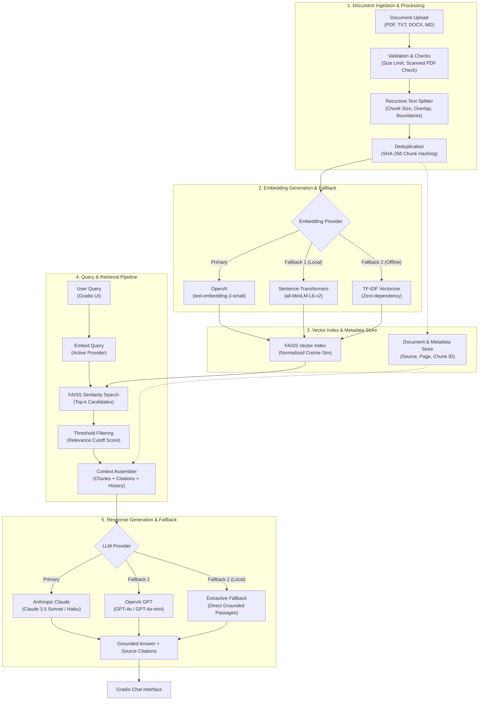

# Mini AI Knowledge Assistant (RAG)

Upload a document, ask questions about it, get answers grounded in the
document's actual content with source citations — not answers guessed from
an LLM's general training data. Full requirements/rationale in
[`PRD_Mini_RAG_Assistant.md`](PRD_Mini_RAG_Assistant.md).

## Quickstart

```bash
python -m venv .venv
source .venv/Scripts/activate   # Windows Git Bash / PowerShell: .venv\Scripts\Activate.ps1
pip install -r requirements.txt
python app.py
```

Opens a Gradio UI at `http://127.0.0.1:7860`. Upload a file from
`sample_docs/`, click **Index document(s)**, then ask a question.

No API key is required — with none set, the app runs on TF-IDF embeddings
and extractive answers (returns the most relevant passages verbatim instead
of a generated answer). To unlock semantic embeddings and generated answers,
copy `.env.example` to `.env` and set `OPENAI_API_KEY` and/or
`ANTHROPIC_API_KEY`.

## Architecture



Backend selection is automatic and falls back gracefully:
- **Embeddings:** OpenAI `text-embedding-3-small` → Sentence-Transformers `all-MiniLM-L6-v2` (local) → TF-IDF (zero-dependency)
- **LLM:** Anthropic Claude → OpenAI GPT → extractive (returns retrieved passages directly)

If an API call fails *at runtime* (bad key, rate limit, outage) — not just a
missing key — the pipeline downgrades to the next local-capable backend
automatically and says so in the indexing log / answer.

## Configuration

All defaults live in `config.py` and are overridable via env vars (see
`.env.example`): chunk size/overlap, top-k, per-backend relevance threshold,
max upload size, conversation history length, and model names.

## Privacy note

When the OpenAI/Anthropic backends are active, document text and questions
are sent to that provider's API for embedding/generation. The Gradio UI
surfaces this in a persistent notice. Leave both API keys unset to keep
everything fully local.

## Known limitations (see PRD Section 7)

- TF-IDF fallback is lexical, not semantic — misses synonym-based matches.
- Index is in-memory per session by default; `VectorStore.save/load` is
  scaffolded but not wired into `app.py`.
- Scanned/image-only PDFs are explicitly rejected (no OCR in v1).
- No automated retrieval-quality evaluation yet (precision@k, RAGAS, etc.) — noted as future work.

## Testing

```bash
pip install -r requirements-dev.txt
pytest
```

Tests use the TF-IDF + extractive backends directly (no API keys / network
needed) and cover: multi-format ingestion, boundary-aware chunking, oversized
file rejection, scanned-PDF detection, dedup, in-scope grounded Q&A,
out-of-scope rejection, and multi-document retrieval.
